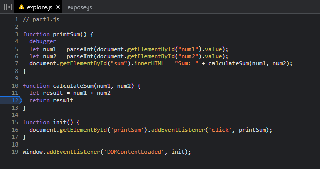

# explore/devtools - Part 2

1. The bug was that it was performing string operations since the user input is not being casted to numerical values.
2. A possible fix would be parsing the user's input as integers using Javascript's `parseInt` function.

